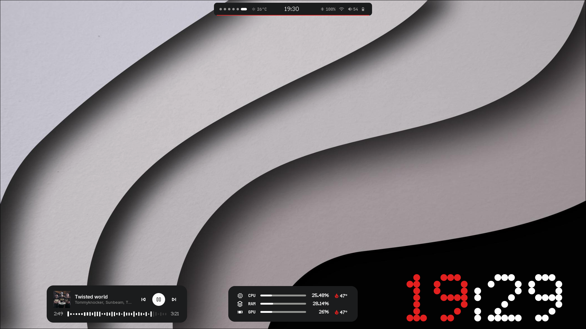
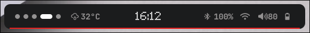
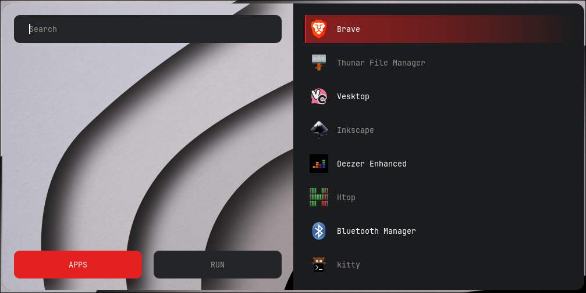
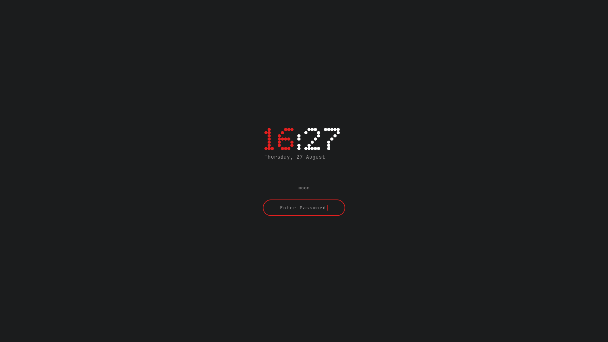
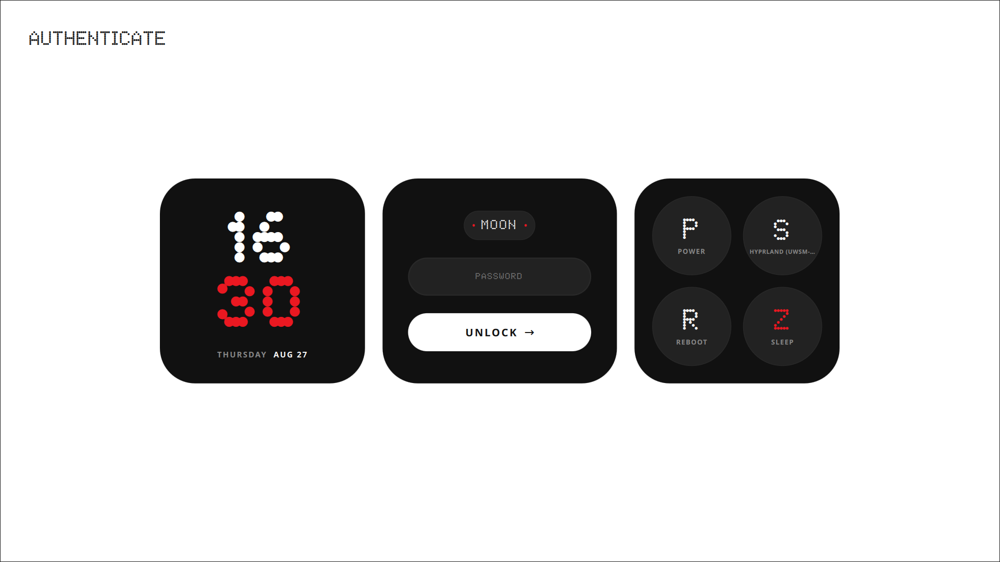
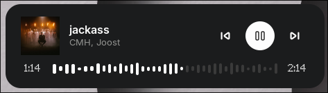
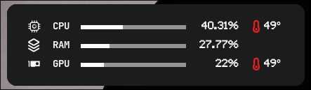
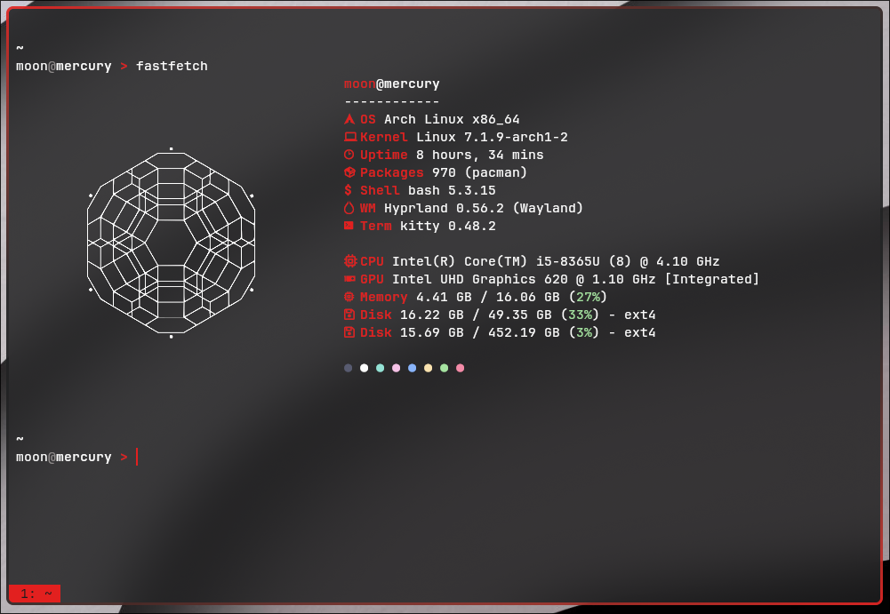
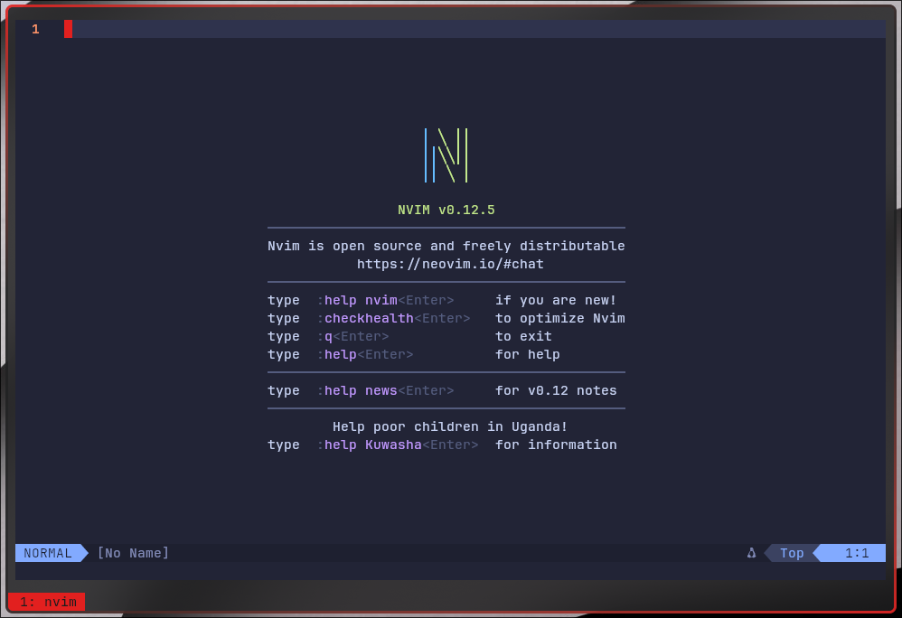
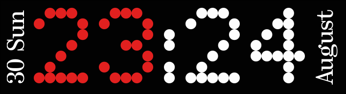

<div align="center">

# dotfiles - Nothing OS Edition

*A Hyprland desktop styled after Nothing OS: flat black, warm white, one red accent.*



</div>

---

## Table of Contents

- [Overview](#overview)
- [Screenshots](#screenshots)
- [Color Palette](#color-palette)
- [Fonts](#fonts)
- [Components](#components)
- [Installation](#installation)
- [Notes](#notes)
- [Credits](#credits)

---

## Overview

These are my personal dotfiles for a Hyprland desktop on Arch Linux, restyled to look
and feel like **Nothing OS**: flat black backgrounds, glyph/dot-matrix typography,
transparent surfaces, and a single red (`#E2201F`) accent used sparingly across every
piece of the stack - login screen, lock screen, bar, launcher, widgets, terminal, and
bootloader.

Every visual layer of the system was touched:

| Layer | Tool |
|---|---|
| Compositor / WM | [Hyprland](https://hyprland.org/) |
| Terminal | [Kitty](https://sw.kovidgoyal.net/kitty/) |
| Display manager (login) | [SDDM](https://github.com/sddm/sddm) (custom QML theme) |
| Lock screen | [Hyprlock](https://github.com/hyprwm/hyprlock) |
| Status bar | [Waybar](https://github.com/Alexays/Waybar) |
| App launcher | [Rofi](https://github.com/davatorium/rofi) |
| Desktop widgets (clock, music, system monitor) | [EWW](https://github.com/elkowar/eww) |
| Shell prompt | [Starship](https://starship.rs/) |
| Bootloader | [Limine](https://limine-bootloader.org/) |
| System info | [Fastfetch](https://github.com/fastfetch-cli/fastfetch) |
| Editor | [Neovim](https://neovim.io/) |

---

## Screenshots

<table>
<tr>
<td width="50%">

**Desktop + Waybar**


</td>
<td width="50%">

**Rofi launcher**


</td>
</tr>
<tr>
<td width="50%">

**Hyprlock lock screen**


</td>
<td width="50%">

**SDDM login screen**


</td>
</tr>
<tr>
<td width="50%">

**EWW music player widget**


</td>
<td width="50%">

**EWW system monitor widget**


</td>
</tr>
<tr>
<td width="50%">

**Kitty terminal + Starship prompt**


</td>
<td width="50%">

**Neovim**


</td>
</tr>
<tr>
<td>

**EWW Clock Widget**


</td>
</tr>
</table>

---

## Color Palette

The whole theme is built on four tokens, reused everywhere (bar, launcher, widgets,
terminal, boot menu):

| Token    | Hex / Value                 | Swatch                                                       | Used for                          |
| -------- | --------------------------- | ------------------------------------------------------------ | --------------------------------- |
| `bg`     | `#1B1C1D`                   |  | Backgrounds                       |
| `base`   | `#FDFDFD`                   |  | Primary text / foreground         |
| `accent` | `#E2201F`                   |  | Highlights, active states, cursor |
| `muted`  | `rgba(245, 240, 240, 0.55)` |  | Secondary text, placeholders      |

## Fonts

| Font | Where it's used | Notes |
|---|---|---|
| [**Nothing Font (5x7)**](https://fontstruct.com/fontstructions/show/2095104/nothing-font-5x7) | EWW clock, Waybar clock, Hyprlock time | Dot-matrix display font |
| [**NDot55**](https://online-fonts.com/fonts/ndot-55/download) | SDDM theme | Loaded via `FontLoader` in `Main.qml` |
| [**NType82**](https://online-fonts.com/fonts/ntype-82) | SDDM `theme.conf` | Fallback/system-level SDDM font |
| [**JetBrainsMono Nerd Font**](https://fonts.google.com/specimen/JetBrains+Mono) | Kitty, Rofi, Waybar, Hyprlock, monitor widget | Monospace + glyph icons |

---

## Components

| Path | What it does |
|---|---|
| `hypr/hyprland.lua` | Main compositor config - binds, autostart, animations, monitor rules |
| `hypr/hyprpaper.conf` | Wallpaper daemon config |
| `hypr/hyprlock.conf` | Lock screen - flat clock, password pill, minimal date label |
| `kitty/kitty.conf` | Terminal theme, tab bar styling, cursor behavior |
| `waybar/config.jsonc`, `style.css` | Top bar: workspaces, weather, network, bluetooth, audio, battery, clock |
| `waybar/reload.sh` | Watches config/style and hot-reloads Waybar on save |
| `rofi/nothing.rasi` | Styled launcher (drun/run/filebrowser/window modes) |
| `rofi/config.rasi` | Base Rofi modes config |
| `eww/eww.yuck`, `eww.scss` | Clock widget + shared imports |
| `eww/music-player.yuck/scss` + `scripts/music-player` | Now-playing widget polling MPRIS via `playerctl` |
| `eww/plasmusic.yuck/scss` + `scripts/plasmusic-status` | Alternate now-playing card with blurred album art background |
| `eww/monitor.yuck/scss` + `scripts/getgpu`, `scripts/gettemp` | Live CPU / RAM / GPU usage + temperature |
| `eww/scripts/getvol` | Volume readout via `wpctl` |
| `sddm/themes/nothing/` | Custom QML login theme (clock, login, power/session/reboot/sleep tiles) |
| `starship/nothingos-starship.toml` | Two-line minimal shell prompt |
| `limine/limine.conf` | Bootloader color palette + font |
| `fastfetch/config.jsonc` | System info fetch, themed to match accent/base |
| `nvim/` | Neovim config: LSP, completion, treesitter, file tree, statusline, colorscheme |


---

## Installation

> These are personal dotfiles, not a packaged installer. Expect to hand-adapt paths.

1. Install the required packages: `hyprland`, `kitty`, `sddm`, `hyprlock`, `hyprpaper`,
   `waybar`, `rofi`, `eww`, `playerctl`, `jq`, `curl`, `starship`, `fastfetch`, and a
   Nerd Font (`JetBrainsMono Nerd Font`).
2. Clone this repo and symlink (or copy) each folder into `~/.config/`:
   ```bash
   git clone <this-repo> ~/dotfiles
   for d in hypr kitty waybar rofi eww nvim starship fastfetch; do
     ln -s ~/dotfiles/$d ~/.config/$d
   done
   ```
3. Install the SDDM theme system-wide:
   ```bash
   sudo cp -r sddm/themes/nothing /usr/share/sddm/themes/
   # then set Theme=nothing in /etc/sddm.conf.d/theme.conf.d
   ```
4. Install `limine.conf` per your bootloader setup (my limine file only contains the theme please add your partition UUID **do not copy `cmdline` / `PARTUUID` blindly**, see below).
5. Grab the fonts referenced above and place them where your font loader expects
   (`~/.local/share/fonts` for userspace apps; SDDM loads its own via `FontLoader`).

---

## Notes


 >[!NOTE] 
 > **`getgpu` calls `sudo intel_gpu_top`.** This means my custom script to get the temperature from my CPU/GPU, I needed to add a passwordless for the command `intel_gpu_top`. 
 
 > [!NOTE]
 > Also good to note, the current script get the temperature of only my CPU, since I only have integrated graphics and no dedicated GPU the temps are the same. I will update the script to get the temperature of dedicated GPU.

## Credits

- Rofi theme adapted from [**Aditya Shakya (adi1090x)**](https://github.com/adi1090x/rofi), recolored to the Nothing OS
  palette.
- SDDM theme by [**Darkkal44** (MIT) Qylock project](https://github.com/Darkkal44/qylock), recolored/restructured for this setup.
- Nothing OS visual language (flat black/white/red, dot-matrix typography) - original
  design by Nothing Technology Limited; this repo is a fan-made desktop skin, not
  affiliated with or endorsed by Nothing.
